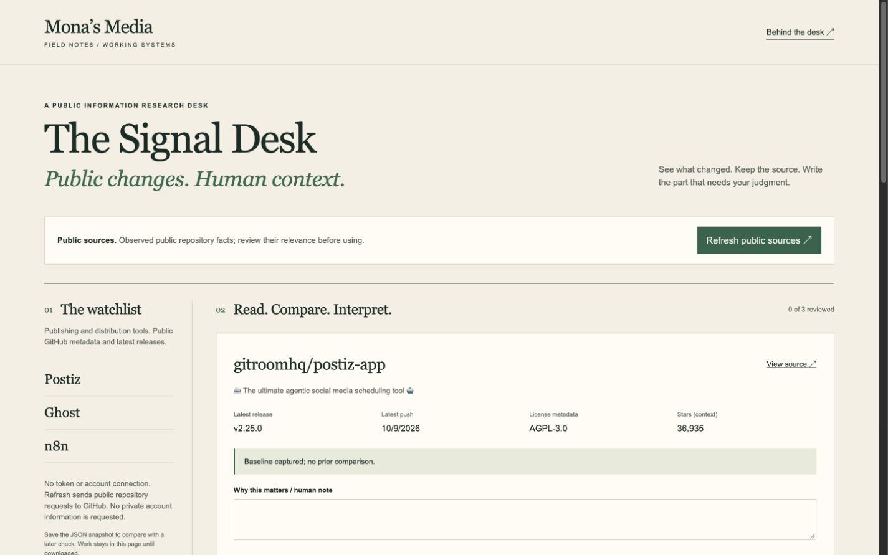

# The Signal Desk

[Open the live demo](https://monaleafah.github.io/signal-desk/) · [Read the case study](https://monaleafah.github.io/signal-desk/case-study.html) · [Quality checks](https://github.com/MonaLeafah/signal-desk/actions)

An original Mona’s Media research workbench: public repository facts → snapshot comparison → human context → source-attached briefing.

Start with the clearly labeled fictional fixture. Refresh reads public metadata and latest releases for Postiz, Ghost, and n8n from GitHub’s API without credentials. Complete source checks replace the snapshot atomically. Errors retain the previous work. Stars are popularity context, not ROI or sales evidence.

Write a human note and review the source. Export a ZIP containing Markdown, JSON, and instructions. Save JSON before reloading; paste a saved snapshot to compare with a later live check. Imports reset review and remain unverified until refreshed. Undo restores the last replaced snapshot.

Open index.html for the fictional workflow. Live refresh requires internet access and GitHub API availability. The app has no backend, private repository access, AI service, analytics, automatic publishing, or recurring monitoring.

Run npm test with Node 20+; no dependencies. MIT code license. No employer code, assets, private records, or source history are included. See QA.md for execution evidence and limits.

[Case study](case-study.html) · [Mona’s Media portfolio](https://monasmedia.com/thework/) · [Field Notes](https://monasmedia.com/thefieldnotes/)
